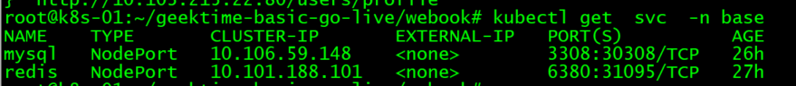

## 网段说明
操作电脑（Windows）、宿主机（ESXi）及虚拟机（Ubuntu）为192网段。

Pods及Service为10网段。

Container Runtime为172网段。对外采用NodePort模式访问，方便跨硬件设备调用。真实生产环境会加入Load Balance。

## 镜像地址
https://hub.docker.com/repository/docker/leventtsang/webook/general
## Dockerfile地址
https://github.com/leventtsang/geekgoclass2/blob/k8s/webook/Dockerfile
备注1：用Ubuntu22.04虚拟机go build，对应容器基座也要用22版本，用20版本会报glibc-2.32版本问题。

## Redis和MySQL的端口已修改。

## 启动端口已修改。

## 启动的第二个pods也能正常应答请求。

## 补充：
## 第一次发送hello请求401，重新注册账号。

## 注册成功。

## 使用登录接口，登录成功。

