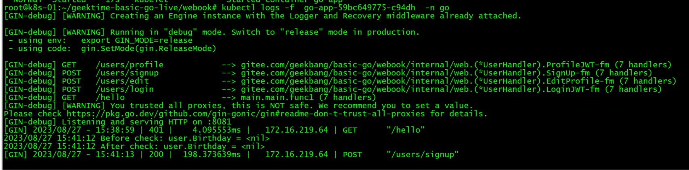

## 镜像地址
https://hub.docker.com/repository/docker/leventtsang/webook/general

## Redis和MySQL的端口已修改。

## 启动端口已修改。

## 启动的第二个pods也能正常应答请求。

## 补充：
## 第一次发送hello请求401，重新注册账号。

## 注册成功。

## 使用登录接口，登录成功。

